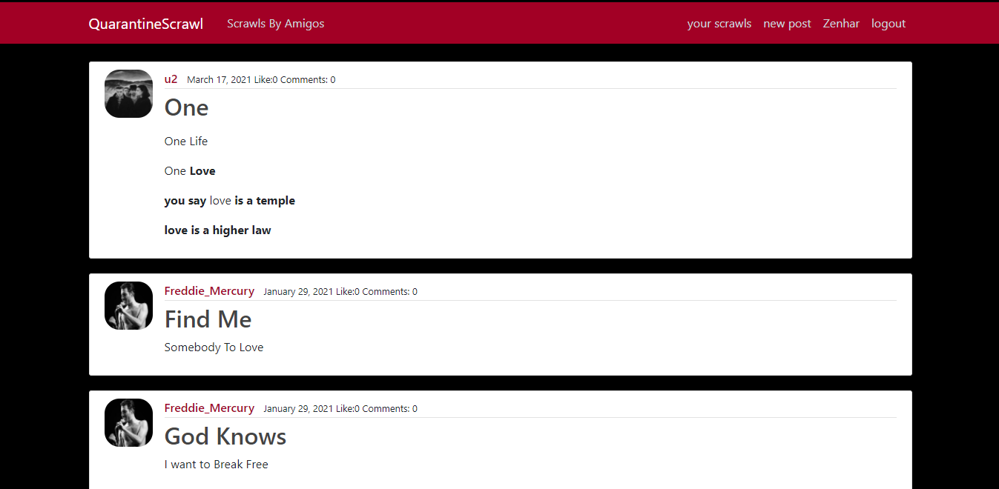
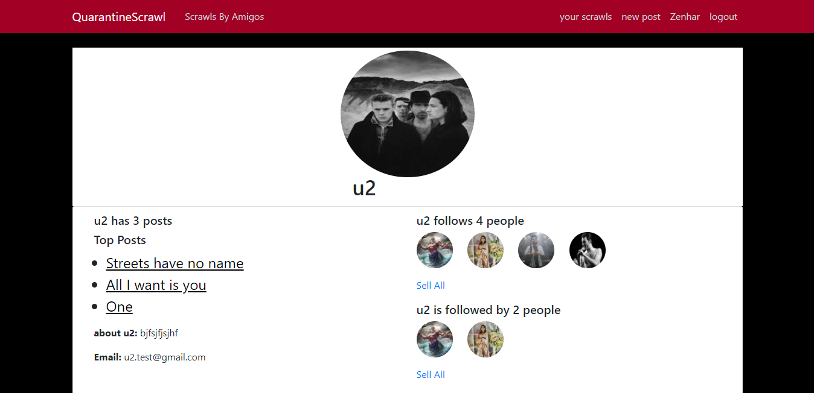

# QuarantineScrawl

A micro blogging site where you talk about your quarantine journey and explore how other people are spending their quarantines!!!

# Screenshots

<ul>
<li>Home</li>

<li>Profile</li>

</ul>

# Demo

[QuarantineScrawl](https://qurantinescrawl.herokuapp.com/)

# Features

- Sign Up & Sign In
- Create, Read, Update and Delete posts.
- Follow Other Users
- Like, Comment on posts.
- A home page consists of top users around the corner
- A home page consists of only followers
- User Permission on comments.

# Tools

- Django
- PostgreSQL
